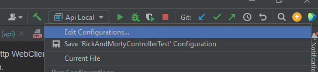
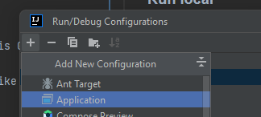
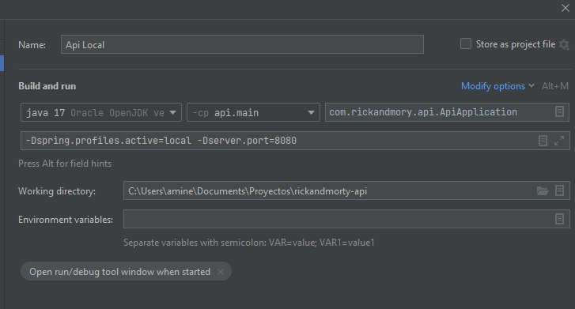
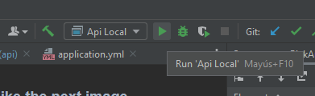

# Rick And Morty Java API
## Description
___
This project is implemented using Java 17 and Spring Framework with some dependecies to create 
an API rest that could do the next. 

This **API** provides an endpoint to get a custom data about a specific character
of Rick And Morty series.

This info are taken from the provided [Rick and Morty API](https://rickandmortyapi.com/documentation/#rest).
## Implementation
___
The solution was implemented using Spring Boot, Java and Gradle to create the API REST/JSON project.
The project has a model package with all the models necessary to transform the data from the API.
Also has a controller package. In this package it is declared the rest controller with the endpoints 
of the API. 
Otherwise, this project has the service layer with all the business and the logic. 
And finally the Repository layer who attacks the Rick and Morty API and get the data. 

To attack the API of Rick and Morty the project uses a Http WebClient configured with 
the base URL of the API inside a declared component like a Bean. 

## Deployment
___
### Run local
___
First you have to download or clone the project from this GitHub. 

Once you do that you can run the project using an IDE like IntelliJ (I use that)
or using the shell. 

* Shell
*You need to have Java 17 or higher to run this project.*

|Run Gradle| ./gradlew bootRun |
|----------|-------------------|

* IDE (like IntelliJ)
You have to configure the IDE following the next steps: 
### 1.   Create a new Configuration clicking on Edit Configuration.
____

### 2. Now add a new configuration.\
___

### 3. Now configure the new configuration like the next image.
___

### 4. Once you have the configuration you only need to run clicking on the run button.
___

### Run with docker
___
To run this project with docker, you need to run the following commands in your shell once 
you are located on the root folder of the project.

| **docker build -t rick-and-morty-api .** |
|------------------------------------------|

Once the image was build you have to run the next command to run a docker container
with this image and specify the port 8080 (you can use any port you want.)

| **docker run -p 8080:8080 rick-and-morty-api** |
|------------------------------------------------|

## Run Tests.
___
To run the tests you can run the next command.

| **./gradlew test** |
|--------------------|
This command run all the created tests in the project. If all tests pass successfully the result
is a BUILD SUCCESSFUL message, else it will throw a BUILD FAILED message.

**Hope everything is well explained, and thanks for reading.**